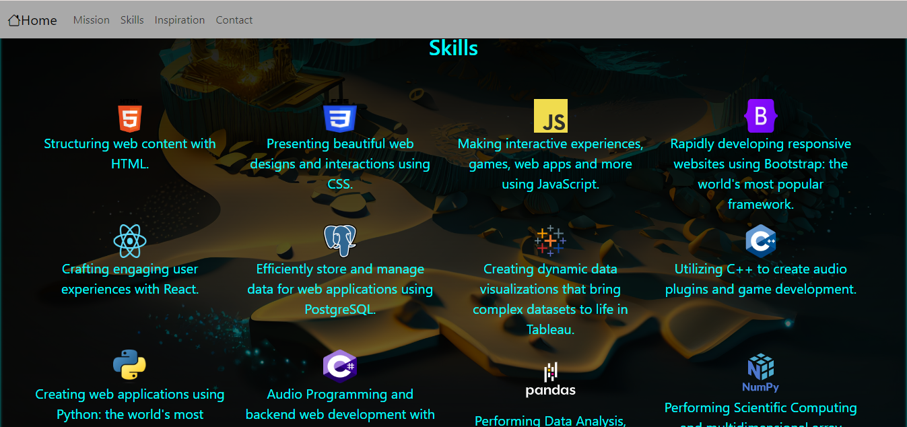

## Portfolio Site
This repository contains the source code for my portfolio site, which showcases my projects and skills. The site is built using HTML, CSS, and Bootstrap.

## Table of Contents
- Description
- Features
- Installation
- Usage
- Screenshots
- Credits

## Description
This portfolio site serves as a professional showcase of my projects and skills. It is built using HTML for structure, CSS for styling, and Bootstrap for responsive design elements such as the navbar.

## Features
Responsive Navbar: The site includes a responsive navbar that collapses into a hamburger menu on smaller screens, providing easy navigation for users on all devices.\
 
Project Showcase: The portfolio section highlights my projects, providing details such as project descriptions, technologies used, and links to live demos or repositories.\
 
Mission Section: A section that introduces myself, my background, and my mission.\
 
Contact: The site includes links to GitHub, LinkedIn, and direct Email.

## Installation
To run this project locally, follow these steps:

- Clone the repository: git clone https://github.com/your-username/portfolio-site.git
- Navigate to the project directory: cd portfolio-site
- Open the index.html file in your web browser.

## Usage
Once the site is open in your web browser, you can navigate through the different sections using the navbar. Click on the project thumbnails to view more details about each project.

Screenshots

 

Credits
 
Bootstrap: https://getbootstrap.com/
 
FontAwesome: https://fontawesome.com/
 
Unsplash: https://unsplash.com/